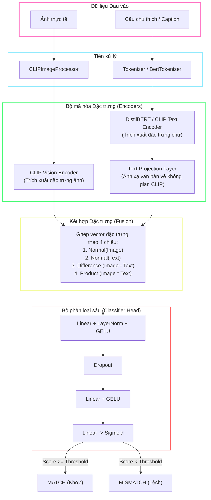

# Image-Text Mismatch Detection (ITMD)
[](https://www.python.org/)
[](https://pytorch.org/)
[](LICENSE)

ITMD là một project kiểm tra xem **một bức ảnh** và **một câu mô tả** có thật sự khớp với nhau hay không. Thay vì chỉ so sánh bằng từ khóa, hệ thống dùng CLIP, text encoder đa ngôn ngữ và một classifier head để đưa ra kết quả `MATCH` hoặc `MISMATCH`.

Dự án có đủ các phần chính: pipeline chuẩn bị dữ liệu, training, inference bằng CLI, Flask API và giao diện web bằng React. Nếu có checkpoint trong `outputs/best_model.pth`, hệ thống sẽ dùng model đã fine-tune; nếu chưa có checkpoint, nó vẫn có thể chạy ở chế độ so sánh cosine similarity.

---

## Quy trình hoạt động



---

## Project này làm được gì?

* Kiểm tra một cặp ảnh - caption và trả về kết quả khớp hoặc không khớp.
* Hỗ trợ cả tiếng Việt và tiếng Anh thông qua Multilingual CLIP.
* Có script tải ảnh COCO và dịch caption sang tiếng Việt để tạo thêm dữ liệu.
* Có training pipeline riêng, bao gồm validation, hard negative mining, early stopping và lưu checkpoint tốt nhất.
* Có biểu đồ đánh giá như confusion matrix, ROC curve và phân phối điểm số.
* Có API Flask và frontend React để dùng thử trực tiếp trên trình duyệt.

---

## Cấu trúc thư mục

```text
├── configs/
│   └── config.py          # Quản lý siêu tham số và đường dẫn dự án
├── data/
│   ├── images/            # Thư mục lưu trữ ảnh huấn luyện và kiểm thử
│   ├── download_data.py   # Script tải ảnh COCO và dịch tự động
│   └── captions_vi.csv     # File nhãn dữ liệu sau khi xử lý Việt ngữ
├── dataset/
│   └── dataset_loader.py  # Dataset class với tính năng Augmentation và lọc ảnh lỗi
├── inference/
│   └── predict.py         # Script chạy suy luận nhanh cho ảnh và văn bản đơn lẻ
├── models/
│   └── clip_model.py      # Định nghĩa mô hình, Processor lai và Classifier Head
├── outputs/               # Lưu trữ mô hình huấn luyện và biểu đồ thống kê
│   ├── best_model.pth     # File trọng số mô hình tốt nhất
│   ├── confusion_matrix.png
│   ├── similarity_distribution.png
│   └── roc_curve.png
├── training/
│   └── train.py           # Vòng lặp huấn luyện, validation và tính ngưỡng tối ưu
├── utils/
│   ├── metrics.py         # Tính toán F1, Accuracy, Recall, Precision và AUC
│   └── similarity.py      # Hàm tính độ tương đồng cosine
├── visualization/
│   └── visualize.py       # Code vẽ biểu đồ với Seaborn & Matplotlib
├── app.py                 # API Backend Flask phục vụ ứng dụng Web
└── README.md
```

---

## Cần chuẩn bị gì trước?

- Python 3.10 trở lên.
- Node.js 18 trở lên để chạy frontend.
- GPU CUDA được khuyến nghị nếu train hoặc inference với dữ liệu lớn.
- Dung lượng ổ đĩa đủ lớn nếu lưu dataset COCO, checkpoint và output model.

Nếu chỉ chạy thử giao diện với API đã có checkpoint, máy CPU vẫn có thể dùng được, nhưng tốc độ sẽ chậm hơn GPU khá nhiều.

## Cài đặt backend Python

### 1. Khởi tạo môi trường ảo Python
Tại thư mục gốc project, tạo môi trường ảo:
```powershell
python -m venv venv
.\venv\Scripts\activate
```

### 2. Cài đặt thư viện cần dùng
Project hiện chưa có `requirements.txt`, nên có thể cài trực tiếp các thư viện chính như sau:
```powershell
pip install torch torchvision transformers huggingface_hub safetensors pandas pillow requests tqdm flask flask-cors scikit-learn matplotlib seaborn sentencepiece
```

> Nếu muốn dùng GPU, nên cài PyTorch theo đúng phiên bản CUDA trên máy của bạn.

---

## Chuẩn bị dữ liệu

Model cần một file CSV mô tả các cặp ảnh - caption. Mặc định project sẽ ưu tiên đọc `data/captions_vi.csv`; nếu file này chưa có thì sẽ thử dùng `data/captions.csv`.

File CSV nên có dạng:

```csv
image_path,caption,label
000000000009.jpg,"Một người đang đứng ngoài trời.",1
000000000025.jpg,"Một chiếc xe đang chạy trên đường.",0
```

Ý nghĩa các cột:

- `image_path`: tên file ảnh nằm trong `data/images/`.
- `caption`: mô tả văn bản cần so khớp với ảnh.
- `label`: `1` là ảnh và caption khớp, `0` là không khớp.

Nếu muốn tạo thêm dữ liệu từ COCO, chạy:

```powershell
.\venv\Scripts\python data/download_data.py
```
Script này sẽ tải ảnh từ COCO train2017, dịch caption sang tiếng Việt và ghi kết quả vào `data/captions_vi.csv`.

> [!NOTE]
> Lần chạy đầu tiên có thể khá lâu vì script cần tải annotation COCO (`annotations_trainval2017.zip`, khoảng 240MB), giải nén `captions_train2017.json` vào `data/annotations/`, rồi mới bắt đầu xử lý dữ liệu.

---

## Cấu hình model

Các tham số quan trọng nằm trong `configs/config.py`. Đây là nơi chọn model, batch size, số epoch, threshold và một số tuỳ chọn training.

```python
# 1. Chạy đa ngôn ngữ (Tiếng Việt & Anh kết hợp)
MODEL_NAME = "sentence-transformers/clip-ViT-B-32-multilingual-v1"

# 2. Hoặc chạy mô hình Tiếng Anh gốc (OpenAI CLIP)
# MODEL_NAME = "openai/clip-vit-base-patch32"

# Các cấu hình huấn luyện quan trọng khác:
BATCH_SIZE = 32
ENABLE_BATCH_NEGATIVES = True  # Tự động tạo mẫu âm khi train và validation
NUM_UNFREEZE_LAYERS = 2        # Số lớp cuối cùng mở băng để fine-tune
```

---

## Huấn luyện và đánh giá

Khi dữ liệu đã sẵn sàng, có thể train model bằng lệnh:

```powershell
.\venv\Scripts\python training/train.py
```

Nếu đã có checkpoint và muốn train tiếp:

```powershell
.\venv\Scripts\python training/train.py --resume
```

Trong quá trình train, project sẽ tự chia train/validation theo cấu hình, tự lưu checkpoint tốt nhất và xuất biểu đồ đánh giá vào `outputs/`.

Các chỉ số được tính gồm:
1. Tính toán đầy đủ **Accuracy, F1-Score, Precision, Recall và AUC-ROC**.
2. Tìm ngưỡng Sigmoid tối ưu nhất dựa trên **Youden's J Statistic** (phương pháp tối đa hóa sự chênh lệch giữa TPR và FPR).
3. Xuất các trực quan hóa tại thư mục `outputs/`:
   * **`confusion_matrix.png`**: Đánh giá chi tiết tỉ lệ phân loại sai.
   * **`similarity_distribution.png`**: Phân phối điểm số tương đồng của cặp Match vs Mismatch.
   * **`roc_curve.png`**: Đường cong đặc trưng hoạt động của bộ nhận dạng với chỉ số AUC thực tế.

---

## Chạy thử bằng dòng lệnh

```powershell
.\venv\Scripts\python inference/predict.py --image data/images/sample_red.jpg --text "Một hình vuông màu đỏ trên màn hình."
```

Nếu muốn thử threshold khác:

```powershell
.\venv\Scripts\python inference/predict.py --image data/images/sample_red.jpg --text "Một hình vuông màu đỏ trên màn hình." --threshold 0.45
```

---

## Chạy backend và frontend

Để chạy và sử dụng hoàn chỉnh ứng dụng Web có kết nối AI, hãy thực hiện theo các bước sau:

### Bước 1: Khởi động AI API server
Mở một Terminal mới tại thư mục gốc dự án `ITMD` và chạy:
```powershell
# Kích hoạt môi trường ảo nếu chưa kích hoạt
.\venv\Scripts\activate

# Khởi chạy Flask Server chạy AI
python app.py
```
*Dịch vụ sẽ tự động nạp model và checkpoint tốt nhất nếu có tại `outputs/best_model.pth`. Backend mặc định chạy tại `http://localhost:5000`.*

**Thông tin cấu hình API (Dành cho việc tích hợp/phát triển thêm):**
* **Endpoint:** `POST http://localhost:5000/api/predict`
* **Tham số nhận vào (Multipart Form Data):**
  * `imageFile`: Tệp tin ảnh đầu vào (File upload).
  * `caption`: Chuỗi văn bản/chú thích cần kiểm tra (Text).
* **Dữ liệu trả về (JSON):**
  ```json
  {
    "isMatch": true,
    "simScore": 0.9142,
    "suggestedCaption": ""
  }
  ```

### Bước 2: Khởi động frontend
Mở thêm **một cửa sổ Terminal thứ hai** tại thư mục gốc dự án `ITMD` và chạy:
```powershell
# Di chuyển vào thư mục Frontend
cd frontend

# Cài đặt thư viện Node.js nếu chạy lần đầu
npm install

# Khởi chạy giao diện Vite
npm run dev
```

### Bước 3: Truy cập và Kiểm thử kết nối
1. Mở trình duyệt web của bạn và truy cập địa chỉ: `http://localhost:5173`.
2. Tải lên một bức ảnh bất kỳ từ máy tính.
3. Nhập câu mô tả (Tiếng Việt hoặc Tiếng Anh).
4. Nhấn nút kiểm tra trên giao diện.
5. Frontend sẽ gửi yêu cầu tới API Backend (`http://localhost:5000/api/predict`) để thực hiện suy luận. Kết quả trả về là `MATCH` hoặc `MISMATCH` kèm điểm số.

## Kiểm tra frontend

```powershell
cd frontend
npm run lint
npm run build
```

## Lưu ý khi phát triển

- `data/images/`, `data/*.csv`, `outputs/` và checkpoint thường rất lớn nên đã được đưa vào `.gitignore`.
- Frontend hiện dùng đăng nhập demo bằng `localStorage`, chưa phải hệ thống xác thực production.
- Flask server đang chạy ở chế độ development. Khi deploy thật cần tắt `debug=True`, giới hạn CORS và chạy qua production WSGI server.
- Nếu đổi `MODEL_NAME`, checkpoint cũ có thể không tương thích với kiến trúc mới.
