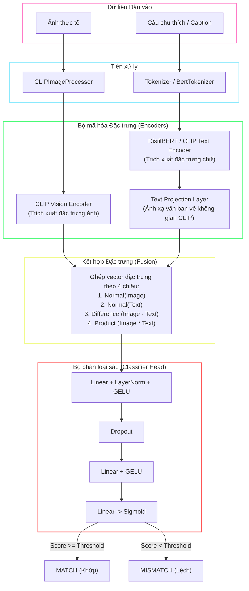

# Image-Text Mismatch Detection (ITMD) Pipeline
[](https://www.python.org/)
[](https://pytorch.org/)
[](LICENSE)

Hệ thống học sâu hoàn chỉnh (End-to-End Deep Learning Pipeline) chuyên dụng cho tác vụ **Phát hiện Không khớp Ảnh-Chữ (Image-Text Mismatch Detection - ITMD)**. Dự án được tối ưu hóa để hỗ trợ cả mô hình CLIP tiếng Anh chuẩn và mô hình CLIP đa ngôn ngữ (chuyên tiếng Việt) nhờ khả năng chuyển đổi kiến trúc động linh hoạt.

---

## ── Quy trình Hoạt động của Hệ thống ──────────────────────────



---

## ── Tính năng Nổi bật ────────────────────────────────────────

* **Hỗ trợ song song cấu trúc động (Dynamic Dual-Architecture):** Tự động chuyển đổi giữa English CLIP gốc (`openai/clip-vit-base-patch32`) và Multilingual CLIP (`sentence-transformers/clip-ViT-B-32-multilingual-v1` kết hợp CLIP Vision) dựa trên tệp cấu hình.
* **Tự động sinh mẫu âm động (Online Hard Negative Mining):** Áp dụng kỹ thuật tráo đổi Caption ngẫu nhiên xoay vòng (`torch.roll`) bên trong từng Batch trên GPU để tự động sinh ra các mẫu Mismatch (nhãn `0`) chất lượng cao với chi phí I/O bằng không.
* **Huấn luyện tinh chỉnh từng phần (Selective Fine-Tuning):** Đóng băng mô hình chính và chỉ mở khóa $N$ lớp Transformer cuối cùng (ở cả Vision Encoder và Text Encoder) cùng tầng chiếu tuyến tính để giảm thiểu tối đa hiện tượng quên lãng thảm họa (catastrophic forgetting).
* **Quy trình chuẩn bị dữ liệu dịch tự động:** Script dịch tích hợp sẵn mô hình HuggingFace `Helsinki-NLP/opus-mt-en-vi` tăng tốc GPU để dịch toàn bộ dataset tiếng Anh và tự động tải ảnh mẫu chất lượng cao từ COCO dataset.
* **Tính toán chỉ số và trực quan hóa chi tiết:** Tự động tìm ngưỡng tối ưu bằng Youden's J Statistic, vẽ ma trận nhầm lẫn (Confusion Matrix), phân phối điểm tương đồng (Similarity Distribution) và đường cong ROC (AUC-ROC) trên tập Validation.

---

## ── Cấu trúc Thư mục Dự án ────────────────────────────────────

```text
├── configs/
│   └── config.py          # Quản lý siêu tham số và đường dẫn dự án
├── data/
│   ├── images/            # Thư mục lưu trữ ảnh huấn luyện và kiểm thử
│   ├── download_data.py   # Script tải ảnh COCO và dịch tự động
│   └── captions_vi.csv     # File nhãn dữ liệu sau khi xử lý Việt ngữ
├── dataset/
│   └── dataset_loader.py  # Dataset class với tính năng Augmentation và lọc ảnh lỗi
├── inference/
│   └── predict.py         # Script chạy suy luận nhanh cho ảnh và văn bản đơn lẻ
├── models/
│   └── clip_model.py      # Định nghĩa mô hình, Processor lai và Classifier Head
├── outputs/               # Lưu trữ mô hình huấn luyện và biểu đồ thống kê
│   ├── best_model.pth     # File trọng số mô hình tốt nhất
│   ├── confusion_matrix.png
│   ├── similarity_distribution.png
│   └── roc_curve.png
├── training/
│   └── train.py           # Vòng lặp huấn luyện, validation và tính ngưỡng tối ưu
├── utils/
│   ├── metrics.py         # Tính toán F1, Accuracy, Recall, Precision và AUC
│   └── similarity.py      # Hàm tính độ tương đồng cosine
├── visualization/
│   └── visualize.py       # Code vẽ biểu đồ với Seaborn & Matplotlib
├── app.py                 # API Backend Flask phục vụ ứng dụng Web
├── main.py                # Pipeline kiểm thử môi trường và demo dự đoán nhanh
└── README.md
```

---

## ── Cài đặt ban đầu ───────────────────────────────────────────

### 1. Khởi tạo môi trường ảo Python
Khuyến nghị sử dụng Python 3.10 trở lên:
```powershell
python -m venv venv
.\venv\Scripts\activate
```

### 2. Cài đặt các thư viện phụ thuộc
Cài đặt PyTorch hỗ trợ GPU CUDA và các thư viện xử lý ảnh, NLP:
```powershell
pip install torch torchvision transformers huggingface_hub safetensors pandas pillow requests tqdm flask flask-cors scikit-learn matplotlib seaborn sentencepiece
```

---

## ── Chuẩn bị Dữ liệu Việt ngữ ───────────────────────────────

Dự án sử dụng cơ sở dữ liệu song ngữ hoặc thuần Việt. Bạn có thể tự động tải và dịch hàng ngàn ảnh chất lượng từ COCO dataset về máy bằng cách chạy:

```powershell
.\venv\Scripts\python data/download_data.py
```
* **Chức năng:** Tải thêm các ảnh mới từ COCO train2017, dịch song song tự động trên GPU sang Tiếng Việt và gộp với bộ dữ liệu gốc để tạo ra tệp nhãn đồng nhất [captions_vi.csv](file:///d:/ITMD/data/captions_vi.csv).

> [!NOTE]
> Khi chạy lần đầu, script [download_data.py](file:///d:/ITMD/data/download_data.py) sẽ tự động tải file nhãn COCO thô (`annotations_trainval2017.zip` khoảng 240MB) từ server của COCO, giải nén tệp `captions_train2017.json` vào thư mục `data/annotations/` và xóa tệp zip rác. Toàn bộ quy trình tải dữ liệu diễn ra hoàn toàn tự động, người dùng mới không cần phải tự chuẩn bị trước dữ liệu gì khác.

---

## ── Cấu hình Mô hình (`configs/config.py`) ────────────────────

Trước khi chạy, bạn hãy mở tệp [config.py](file:///d:/ITMD/configs/config.py) để lựa chọn cấu hình hệ thống:

```python
# 1. Chạy đa ngôn ngữ (Tiếng Việt & Anh kết hợp)
MODEL_NAME = "sentence-transformers/clip-ViT-B-32-multilingual-v1"

# 2. Hoặc chạy mô hình Tiếng Anh gốc (OpenAI CLIP)
# MODEL_NAME = "openai/clip-vit-base-patch32"

# Các cấu hình huấn luyện quan trọng khác:
BATCH_SIZE = 32
ENABLE_BATCH_NEGATIVES = True  # Tự động tạo mẫu âm khi train và validation
NUM_UNFREEZE_LAYERS = 2        # Số lớp cuối cùng mở băng để fine-tune
```

---

## ── Huấn luyện & Đánh giá (Training Pipeline) ─────────────────

Chương trình huấn luyện tích hợp sẵn tính năng tự động khôi phục (Resume) từ checkpoint tốt nhất nếu kiến trúc tương thích, đồng thời tự động tắt nếu phát hiện kiến trúc không tương thích và cảnh báo để train lại từ đầu.

```powershell
# Chạy huấn luyện (tự động chia 90% train, 10% validation)
.\venv\Scripts\python training/train.py

# Huấn luyện tiếp tục từ checkpoint hiện có
.\venv\Scripts\python training/train.py --resume
```

### Quá trình đánh giá cuối Epoch bao gồm:
1. Tính toán đầy đủ **Accuracy, F1-Score, Precision, Recall và AUC-ROC**.
2. Tìm ngưỡng Sigmoid tối ưu nhất dựa trên **Youden's J Statistic** (phương pháp tối đa hóa sự chênh lệch giữa TPR và FPR).
3. Xuất các trực quan hóa tại thư mục `outputs/`:
   * **`confusion_matrix.png`**: Đánh giá chi tiết tỉ lệ phân loại sai.
   * **`similarity_distribution.png`**: Phân phối điểm số tương đồng của cặp Match vs Mismatch.
   * **`roc_curve.png`**: Đường cong đặc trưng hoạt động của bộ nhận dạng với chỉ số AUC thực tế.

---

## ── Chạy Suy luận & Dự đoán (Inference) ───────────────────────

### Chạy demo kiểm thử nhanh toàn bộ luồng
```powershell
.\venv\Scripts\python main.py
```

### Chạy dự đoán cho 1 cặp ảnh - văn bản tùy ý qua CLI
```powershell
.\venv\Scripts\python inference/predict.py --image data/images/sample_red.jpg --text "Một hình vuông màu đỏ trên màn hình."
```
* **Lưu ý:** Ngưỡng phân loại mặc định sẽ tự động lấy từ giá trị `CLASSIFIER_THRESHOLD` tối ưu trong file config. Bạn có thể ghi đè ngưỡng này bằng cách bổ sung `--threshold 0.45`.

---

## ── Hướng dẫn Chạy Tích hợp Frontend & Backend ──────────────────

Để chạy và sử dụng hoàn chỉnh ứng dụng Web có kết nối AI, hãy thực hiện theo các bước sau:

### Bước 1: Khởi động AI API Server (Lắng nghe tại cổng 5000)
Mở một Terminal mới tại thư mục gốc dự án `ITMD` và chạy:
```powershell
# Kích hoạt môi trường ảo nếu chưa kích hoạt
.\venv\Scripts\activate

# Khởi chạy Flask Server chạy AI
python app.py
```
*Dịch vụ sẽ tự động nạp mô hình AI (Multilingual CLIP) cùng checkpoint tốt nhất và lắng nghe tại cổng `http://localhost:5000`.*

**Thông tin cấu hình API (Dành cho việc tích hợp/phát triển thêm):**
* **Endpoint:** `POST http://localhost:5000/api/predict`
* **Tham số nhận vào (Multipart Form Data):**
  * `imageFile`: Tệp tin ảnh đầu vào (File upload).
  * `caption`: Chuỗi văn bản/chú thích cần kiểm tra (Text).
* **Dữ liệu trả về (JSON):**
  ```json
  {
    "isMatch": true,
    "simScore": 0.9142,
    "suggestedCaption": ""
  }
  ```

### Bước 2: Khởi động Giao diện Web Frontend (Lắng nghe tại cổng 5173)
Mở thêm **một cửa sổ Terminal thứ hai** tại thư mục gốc dự án `ITMD` và chạy:
```powershell
# Di chuyển vào thư mục Frontend
cd frontend

# Cài đặt thư viện Node.js nếu chạy lần đầu
npm install

# Khởi chạy giao diện phát triển Vite
npm run dev
```

### Bước 3: Truy cập và Kiểm thử kết nối
1. Mở trình duyệt web của bạn và truy cập địa chỉ: `http://localhost:5173`.
2. Tải lên một bức ảnh bất kỳ từ máy tính.
3. Nhập câu mô tả (Tiếng Việt hoặc Tiếng Anh).
4. Nhấn nút kiểm tra trên giao diện.
5. Giao diện Frontend sẽ gửi yêu cầu tới API Backend (`http://localhost:5000/api/predict`) để AI thực hiện suy luận. Bạn sẽ thấy kết quả phân loại Khớp/Lệch cùng điểm số tương đồng hiển thị trực quan trên giao diện ngay lập tức!

